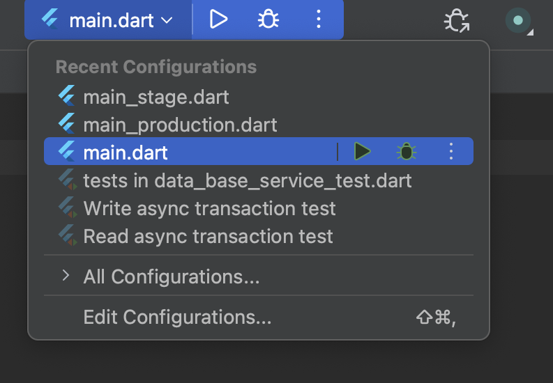

# Flutter application template

The template of a Flutter project.

## Getting Started

This project is the initial template for the Flutter application with authentication example, geolocation and upload of open weather information using the REST API
It is based on clean architecture and uses modular extensible structure.

Integrated plugins:
1. [Riverpod: A reactive caching and data-binding framework](https://pub.dev/packages/riverpod)
2. [Firebase envirounment:](https://firebase.google.com/docs/flutter/setup?platform=ios)
- [firebase_core](https://pub.dev/packages/firebase_core)
- [firebase_storage](https://pub.dev/packages/firebase_storage)
- [cloud_firestore](https://pub.dev/packages/cloud_firestore)
- [firebase_auth](https://pub.dev/packages/firebase_auth)
- [firebase_crashlytics](https://pub.dev/packages/firebase_crashlytics)
- [firebase_dynamic_links](https://pub.dev/packages/firebase_dynamic_links)
- [firebase_messaging](https://pub.dev/packages/firebase_messaging)
3. [HTTP networking package: dio](https://pub.dev/packages/dio)
4. [Annotate Dart objects in order to Serialize/Deserialize them to/from JSON: dart_json_mapper](https://pub.dev/packages/dart_json_mapper)
5. [Geolocation plugin: geolocator](https://pub.dev/packages/geolocator)
6. [NOSQL Database: ObjectBox](https://pub.dev/packages/objectbox)
7. [A declarative app router: go_router](https://pub.dev/packages/go_router)
8. And much other:
- equatable
- dartz
- package_info_plus
- shared_preferences
- path_provider, path
- freezed, freezed_annotation

More detailed information for these plugins could be found on the [pub.dev](https://pub.dev)

A few resources to get you started if this is your first Flutter project:

- [Lab: Write your first Flutter app](https://docs.flutter.dev/get-started/codelab)
- [Cookbook: Useful Flutter samples](https://docs.flutter.dev/cookbook)

For help getting started with Flutter development, view the
[online documentation](https://docs.flutter.dev/), which offers tutorials,
samples, guidance on mobile development, and a full API reference.

This project support manage and setting a flavor envirounment.
Command line Android Flavor for run and/or build (Flavor setting can not used for run build in the Android Studio)

Run:
```
flutter run --flavor production -t lib/main_production.dart
flutter run --flavor stage -t lib/main_stage.dart
flutter run --flavor development -t lib/main.dart
```

Build APK:
```
flutter build apk --flavor production -t lib/main_production.dart
flutter build apk --flavor stage -t lib/main_stage.dart
flutter build apk --flavor development -t lib/main.dart
```

Run Flavor configuration from Android Studio:


## Warnings

In this project used the
[dart_json_mapper plugin](https://pub.dev/packages/dart_json_mapper) for
serialization the data entities from/to Java.

Also this project included [ObjectBox](https://pub.dev/packages/objectbox) as local data storage service

Before first build/run and after any changes a data models, run this command in terminal on the project folder:
```
dart run build_runner build --delete-conflicting-outputs
```
Or to re-run code generation each time you are making changes
```
 dart run build_runner watch --delete-conflicting-outputs
```